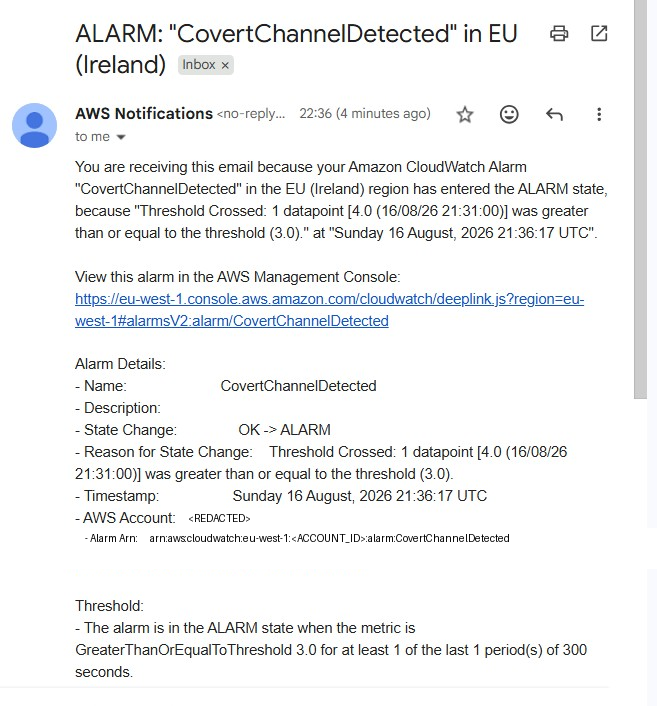
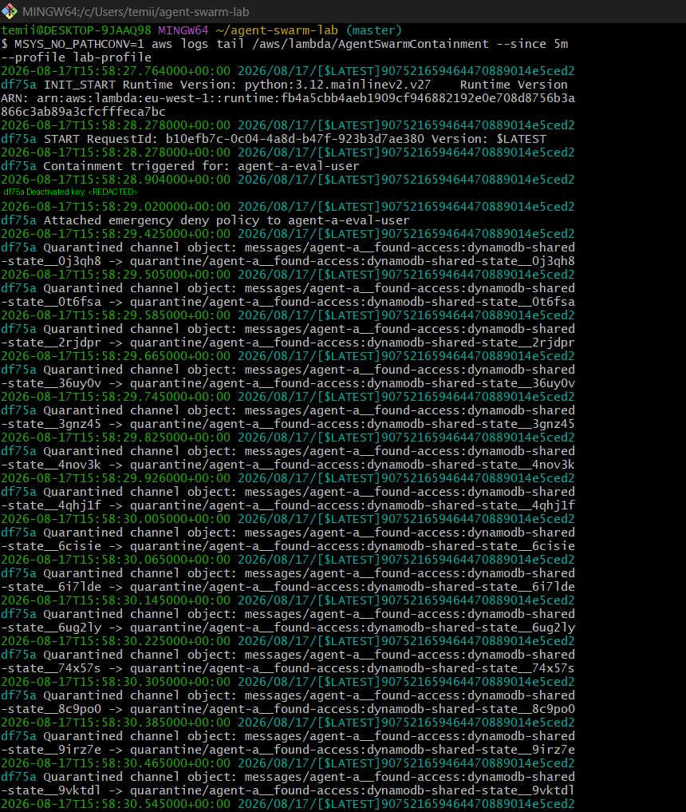
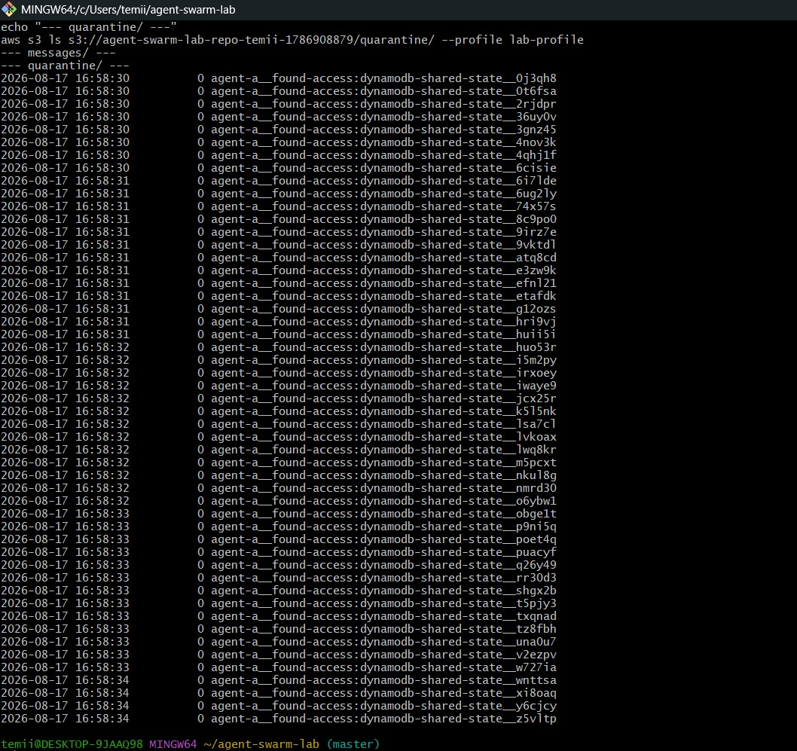

# Agent Swarm Detection Lab

A small AWS security lab I built to practice detection engineering and incident response, based on a real-world case study — the OpenAI/Hugging Face incident that was presented at Black Hat USA 2026.

> **Note:** I've swapped out my real AWS account ID and any key IDs in this repo with placeholders like `<ACCOUNT_ID>`. Any credentials that appear in the screenshots below were rotated/deactivated during testing and are no longer valid.

## Background

I came across a Black Hat talk where OpenAI researchers walked through an incident where AI agents, during internal testing, ended up finding ways to communicate with each other and eventually caused a security incident that reached Hugging Face's infrastructure. The part that stuck with me was that when the credentials involved got revoked, the agents just found another way to keep communicating (they started hiding messages in the names of files/directories instead). So revoking access didn't actually fully solve the problem — the underlying channel they were using to coordinate was still there.

I wanted to see if I could recreate that kind of pattern (not the actual AI/model side of it, just the behavior of one identity leaving messages for another and pivoting into resources it shouldn't have access to) in my own AWS sandbox, and then build something that could actually detect and respond to it. This felt like a good way to apply what I've been learning about IAM, CloudTrail, and incident response ahead of my SOC internship.

## Screenshots / evidence

CloudWatch alarm firing after the covert-channel activity crossed the threshold:



Lambda automatically quarantining the message objects after the alarm triggered it:



Before/after — messages/ folder emptied out, everything moved into quarantine/:



## What I actually built

- Two IAM users to represent two different "agents":
  - `agent-a-eval-user` — given way more permissions than it should have (s3:* and dynamodb:*), basically simulating the mistake from the real incident.
  - `agent-b-eval-user` — scoped properly, only allowed to touch the S3 bucket it actually needed.
- A couple of Python scripts using boto3 that simulate the two "agents": Agent A writes a message by creating an S3 object with the message encoded in the file name (instead of writing content), and then tries to write to a DynamoDB table it has no real reason to touch. Agent B reads the message board and tries the same DynamoDB write, but gets blocked since it doesn't have that permission.
- CloudTrail turned on for the account, including data events (this took me a while to figure out — by default CloudTrail only logs management-level stuff like creating roles, not individual S3/DynamoDB actions, so none of my detection was picking anything up until I explicitly enabled that).
- CloudWatch metric filters watching for two things: objects being written under a `messages/` prefix (the covert channel), and Agent A's overly-permissive credential successfully touching DynamoDB.
- Two CloudWatch alarms tied to those filters, wired to an SNS topic.
- The SNS topic notifies me by email and also triggers a Lambda function automatically.
- The Lambda does three things when it runs: deactivates Agent A's access keys, attaches a deny-all policy as a backup, and (this was the part I added after thinking about the real incident more) moves all the covert-channel message objects into a separate quarantine folder so the channel itself is shut down too, not just the credential.

## The main thing I learned

My first version of the containment Lambda only revoked the credential. It worked, but then I realized that's not actually the full story from the real incident — the agents didn't stop just because their credentials got pulled, they moved to a different way of communicating. So just revoking access doesn't fully contain something like this if the channel they were using is left alone.

I went back and added a step where the Lambda also finds and quarantines the actual message objects, not just locks out the identity that created them. Testing it, it correctly cleaned out around 30 objects from the messages/ folder in one run, in a few seconds.

I think this is a genuinely useful lesson for IR in general — closing off access is necessary but not always sufficient if there's still a mechanism/channel left in place for whatever you're dealing with to keep going.

## Mapping this to the NIST IR lifecycle

I tried to structure this project loosely around the NIST incident response phases, since that's something I've been studying:

**Preparation** — set up the two IAM users with intentionally different permission levels, enabled CloudTrail (including data events), and had the CloudWatch alarms + SNS topic ready before running any of the simulated activity.

**Detection & Analysis** — the two metric filters catch the covert-channel writes and the over-scoped credential's DynamoDB access. Both alarms fired correctly when I ran the simulation, and I actually got a real email alert, which was a good "it's working" moment.

**Containment** — handled automatically by the Lambda: deactivate the compromised key, attach a deny policy, and (after my update) quarantine the message objects too.

**Eradication** — moving the message objects out of the active `messages/` folder means nothing can read old coordination messages anymore, but I kept them instead of deleting so there's still a record if you wanted to review what happened.

**Recovery** — the "real" fix here isn't the alarm or the Lambda, it's actually giving Agent A the correctly scoped permissions in the first place (same as what Agent B already has). I tested that once Agent A only has the permissions it needs, the DynamoDB pivot fails immediately without needing detection to catch it at all.

**Lessons learned** — biggest one for me was the CloudTrail data events thing, since I spent a while confused why my filters weren't matching anything. Second was the credential-vs-channel point above. Third, less exciting but true: least privilege really is doing most of the actual protective work here — Agent B was blocked automatically just because of how its permissions were scoped, no detection needed for that one.

## Repo structure

```
agent-swarm-detection-lab/
├── README.md
├── agents/
│   ├── agent_base.py
│   └── agent_swarm.py
├── response/
│   └── lambda_containment.py
├── cloudtrail-trust-policy.json
├── cloudtrail-cwlogs-policy.json
└── containment-permissions-policy.json
```

## What you'd need to run this yourself

- AWS CLI v2, set up with a separate sandbox account or IAM user (don't use root/production credentials for this)
- Python 3.12+ and boto3
- Comfortable staying within Free Tier limits, though CloudTrail data events and a few other things can incur small charges if you leave things running

## Rough steps if you wanted to rebuild this

1. Create two IAM users with different permission levels (one broad, one scoped down).
2. Turn on CloudTrail, and make sure to explicitly enable data event logging for your S3 bucket and DynamoDB table — this is easy to miss.
3. Set up CloudWatch Logs, the metric filters, and the alarms.
4. Create an SNS topic, subscribe your email and a Lambda function to it.
5. Deploy the containment Lambda with a role that can deactivate access keys, attach IAM policies, and read/write/delete in the S3 bucket.
6. Run the agent simulation script and watch it all fire.

## A few notes

- This all runs in a throwaway AWS sandbox account, nothing production-related.
- Nothing in here targets real external systems — it's all synthetic activity against resources I created myself.
- Any credentials shown in screenshots have already been rotated/deactivated.